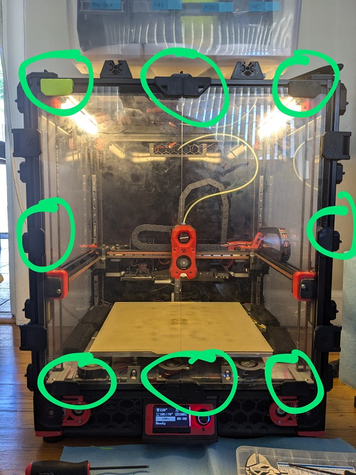
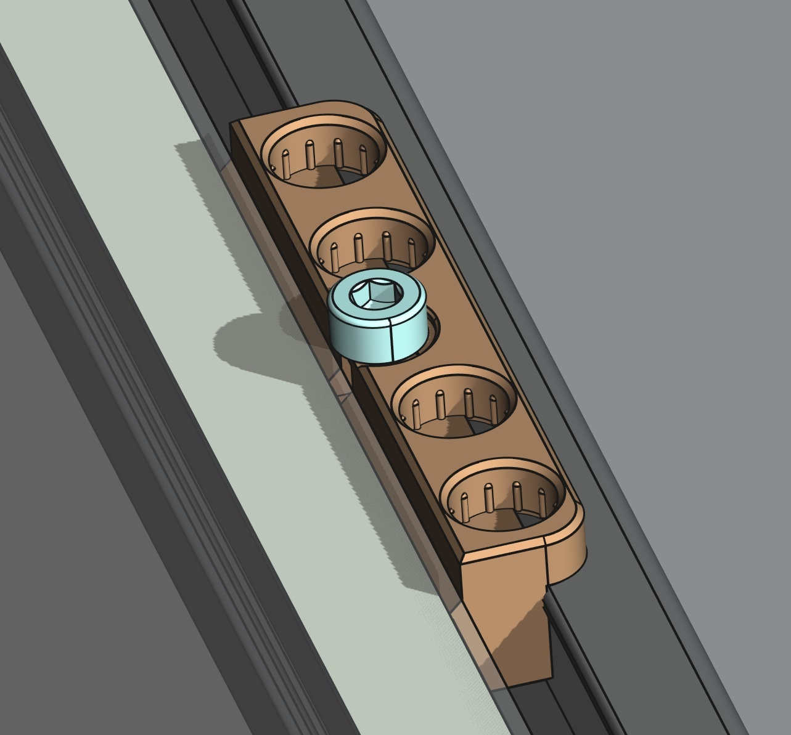
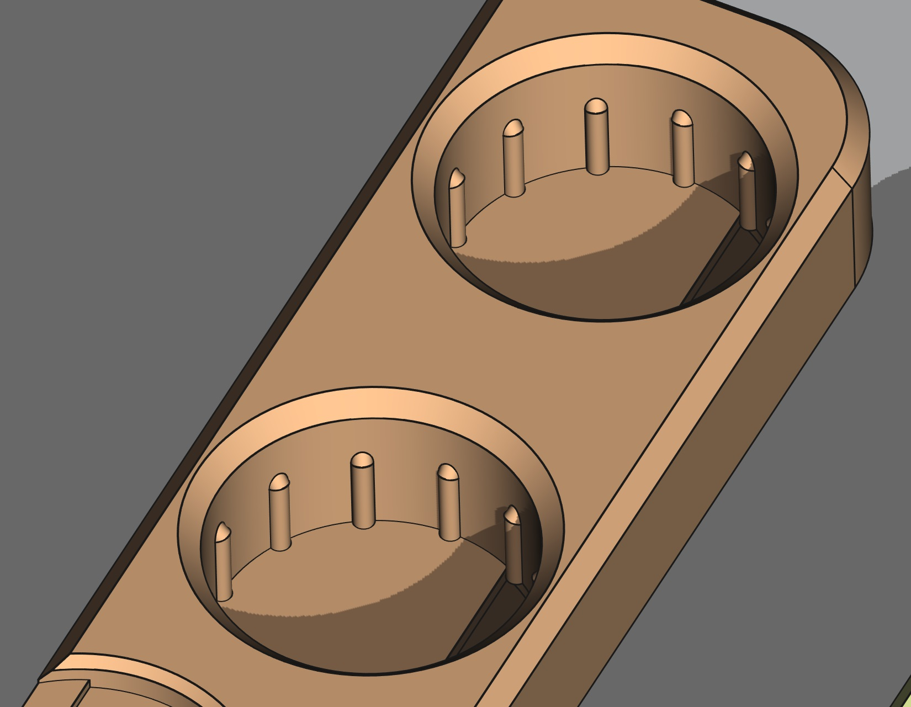
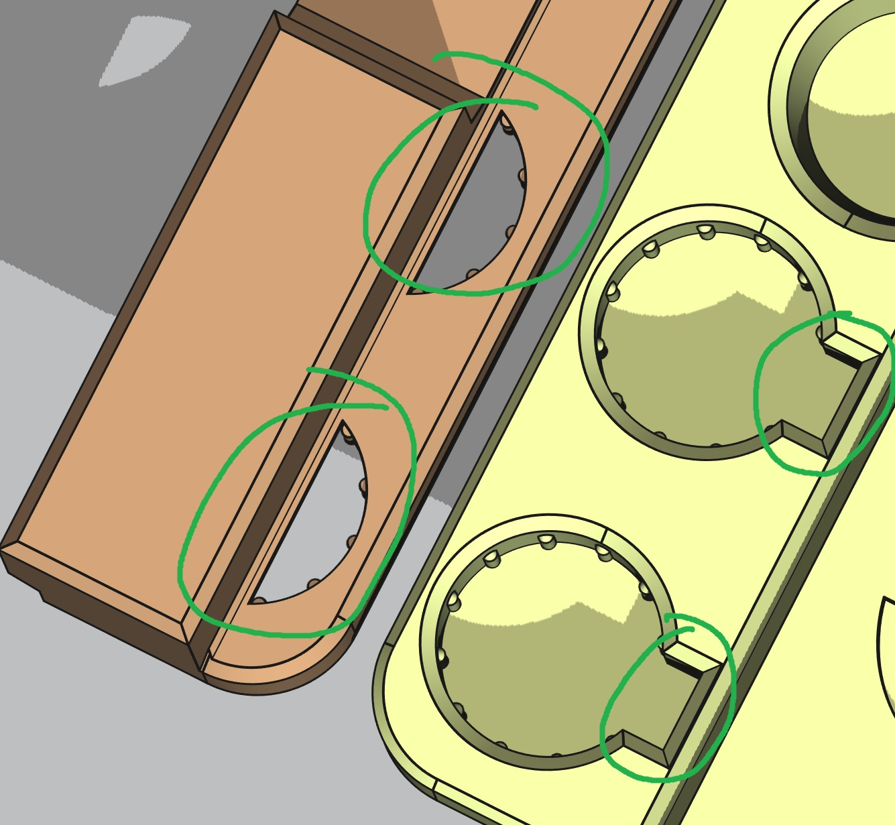
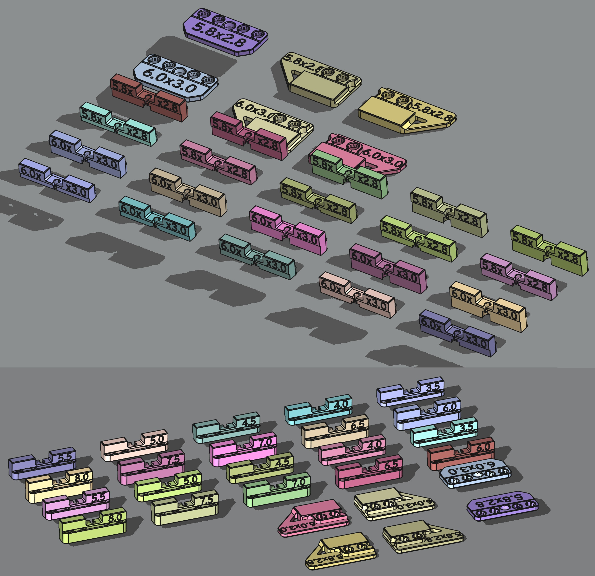
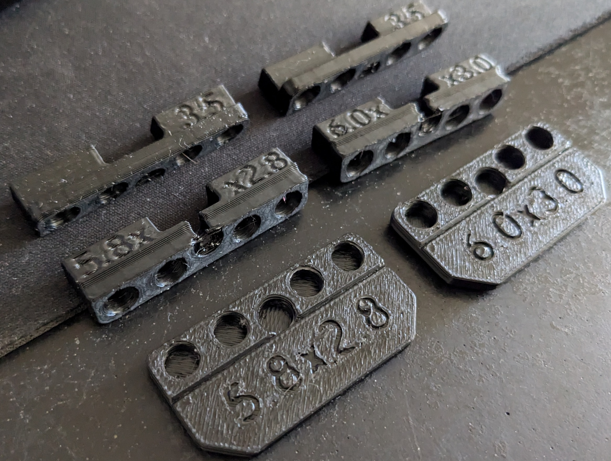

# Button up your Voron front doors

The stock Voron doors do not always seal fully all around.
Especially at higher chamber temperature.
The doors have a tendecy to flex away from the frame ever so slightly.
Allowing relatively cold ambiant air to flow in, warping big prints.

This mod adds (a lot of) magnets for keeping the door sealed at all time at any temperature.
One part mounts on the frame, the mating part goes on the door.
Joined by four pairs of magnets.

This is enough magnets to seal well with those ubiquitous low quality magnets.
Though keep in mind that the worst ones will lose almost all strength beyond 70°C.

Be aware that with N52 grade magnets; rated for 80°C; the doors might become difficult to open at ambient temperature.
You can always start with half the magnets.

This mod also comes with handles for a consistantly tight seal at high chamber temperature all around.

## Printed parts and hardware

All parts to prints are in the folders [STLs/](STLs/) and [STEPs/](STEPs/) (your choice).
You will find variation for 5.8x2.8mm and 6.0x3.0mm magnets for the four parts.
As well as various door thicknesses (door + seal) for the part that mounts on the frame.

For the stock Voron2.4 you want the "6.0x3.0magnet_3.5mm_door" variant.

### Recommended full set

3 buttonup per doors in addition to the handles. See photo atop.

#### Printed parts
 - buttonup_frame ×8.
 - buttonup_door ×6.
 - buttonup_handle_a ×2.
 - buttonup_handle_b ×2.

#### Hardware
 - ~6x3mm magnets ×64.
 - M3x8mm (for 3.5mm doors. Longer for thicker door) ×8.
 - M3 hammer nut ×8.
 - VHB tape ~44x13mm ×6.
 - VHB tape ~27x13mm ×4.

### Per buttonup

You probably want 6 of them.

#### Printed parts
 - buttonup_frame ×1.
 - buttonup_door ×1.

#### Hardware
 - ~6x3mm magnets ×8.
 - M3x8mm (for 3.5mm doors. Longer for thicker door) ×1.
 - M3 hammer nut ×1.
 - VHB tape ~44x13mm ×1.

### For a set of four handles

#### Printed parts
 - buttonup_frame ×2.
 - buttonup_handle_a ×2.
 - buttonup_handle_b ×2.

#### Hardware
 - ~6x3mm magnets ×16.
 - M3x8mm (for 3.5mm doors. Longer for thicker door) ×2.
 - M3 hammer nut ×2.
 - VHB tape ~27x13mm ×4.

## Demo

https://github.com/user-attachments/assets/6517687b-0205-439a-93e8-213152b58843

## Details

The buttonup_frame adds clearance around the doors compared to the stock part. With the exception of the screw, which cannot possibly be moved. This reduces friction.

After ABS shrinkage, the top of the pocket should be about the same diameter as the magnet for a friction fit. Half-way down the pocket, 0.2mm ridges add extra interference for a tight fit.

To make magnet removal easier, the frame part has holes to push them out from the back. The door parts have accomodation for a small flat head screw driver.

For easy identification; before and after printing; the magnet dimensions are written on every parts. With the addition of the door size on the frame part.

